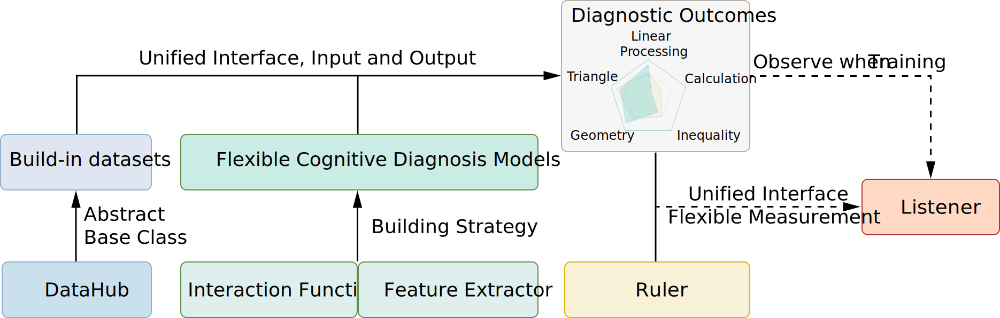

<div align='center'>
<h1>InsCD: A Modularized, Comprehensive and User-Friendly Toolkit for Machine Learning Empowered Cognitive Diagnosis</h1>

<a href='https://aiedu.ecnu.edu.cn/'>Shanghai Institute of AI Education</a>, <a href='http://www.cs.ecnu.edu.cn/'>School of Computer Science and Technology</a>

East China Normal University


</div>

InsCD, namely Instant Cognitive Diagnosis (Chinese: 时诊), is a highly modularized python library for cognitive diagnosis in intelligent education systems. This library incorporates both traditional methods (e.g., solving IRT via statistics) and deep learning-based methods (e.g., modelling students and exercises via graph neural networks). 

<div align='center'>

<a href=''></a> 
<a href='https://sites.google.com/view/inscd-doc/home'></a>
<a href=''></a>

</div>

## 📰 News 
- [x] [2024.7.14] InsCD toolkit v1.1 is released and available for downloading.
- [x] [2024.4.20] InsCD toolkit v1.0 is released.

## 🚀 Getting Started
### Installation
Git and install with pip:
```
git clone https://github.com/ECNU-ILOG/inscd.git
cd <path of code>
pip install .
```
or install the library from pypi
```
pip install inscd
```
### Quick Example
The following code is a simple example of cognitive diagnosis implemented by inscd. We load build-in datasets, create cognitive diagnosis model, train model and show its performance:  
```python
from inscd.datahub import NeurIPS20
from inscd.models.neural import NCDM

listener.activate()
datahub = NeurIPS20()
datahub.random_split()
datahub.random_split(source="valid", to=["valid", "test"])

ncdm = NCDM()
ncdm.build(datahub)
ncdm.train(datahub, "train", "valid")

test_results = ncdm.score(datahub, "test", metrics=["acc", "doa"])
```

For more details, please refer to **[InsCD Documentation](https://sites.google.com/view/inscd-doc/home)**.

## 🛠 Implementation
We incoporate classical, famous and state-of-the-art methods published or accepted by leading journals and conferences in the field of psychometric, machine learning and data mining. The reason why we call this toolkit "modulaized" is that we not only provide the "model", but also divide the model into two parts (i.e., extractor and interaction function), which enables us to design new models (e.g., extractor of Hypergraph with interaction function of KaNCD). To evaluate the model, we also provide vairous open-source datasets in online or offline scenarios.

### List of Models
|Model|Release|Paper|
|-----|------------|-----|
|Item Response Theory (IRT)|1952|Frederic Lord. A Theory of Test Scores. _Psychometric Monographs_.|
|Deterministic Input, Noisy "And" Gate (DINA)|2008|Jimmy De La Torre. An Empirically Based Method of Q-matrix Validation for the DINA Model: Development and applications. _Journal of Educational Measurement_.|
|Multidimentional Item Response Theory (MIRT)|2009|Mark D. Reckase. _Multidimensional Item Response Theory Models_.|
|Neural Cognitive Diagnosis Model (NCDM)|2020|Fei Wang et al. Neural Cognitive Diagnosis for Intelligent Education Systems. _AAAI'20_.|
|Item Response Ranking (IRR)|2021|Shiwei Tong et al. Item Response Ranking for Cognitive Diagnosis. _IJCAI'21_.|
|Relation Map-driven Cognitive Diagnosis Model (RCD)|2021|Weibo Gao et al. RCD: Relation Map Driven Cognitive Diagnosis for Intelligent Education Systems. _SIGIR'21_|
|Knowledge-association Neural Cognitive Diagnosis (KaNCD)|2022|Fei Wang et al. NeuralCD: A General Framework for Cognitive Diagnosis. _TKDE_.|
|Knowledge-sensed Cognitive Diagnosis Model (KSCD)|2022|Haiping Ma et al. Knowledge-Sensed Cognitive Diagnosis for Intelligent Education Platforms. _CIKM'22_.|
|Q-augmented Causal Cognitive Diagnosis Model (QCCDM)|2023|Shuo Liu et al. QCCDM: A Q-Augmented Causal Cognitive Diagnosis Model for Student Learning. _ECAI'23_.|
|Self-supervised Cognitive Diagnosis Model (SCD)|2023|Shanshan Wang et al. Self-Supervised Graph Learning for Long-Tailed Cognitive Diagnosis. _AAAI'23_.|
|Symbolic Cognitive Diagnosis Model (SCDM)|2024|Junhao Shen et al. Symbolic Cognitive Diagnosis via Hybrid Optimization for Intelligent Education Systems. _AAAI'24_.|
|Hypergraph Cognitive Diganosis Model (HyperCDM)|2024|Junhao Shen et al. Capturing Homogeneous Influence among Students: Hypergraph Cognitive Diagnosis for Intelligent Education Systems. _KDD'24_.|
|Oversmoothing-Resistant Cognitive Diagnosis Framework (ORCDF)|2024|Shuo Liu et al. ORCDF: An Oversmoothing-Resistant Cognitive Diagnosis Framework for Student Learning in Online Education Systems. _KDD'24_.|

### List of Build-in Datasets
|Dataset|Release|Source|
|-------|-------|------|
|`inscd.datahub.Assist17`|2018|https://sites.google.com/view/assistmentsdatamining/dataset|
|`inscd.datahub.FracSub`|2015|http://staff.ustc.edu.cn/%7Eqiliuql/data/math2015.rar|
|`inscd.datahub.Junyi734`|2015|https://www.educationaldatamining.org/EDM2015/proceedings/short532-535.pdf|
|`inscd.datahub.Math1`|2015|http://staff.ustc.edu.cn/%7Eqiliuql/data/math2015.rar|
|`inscd.datahub.Math2`|2015|http://staff.ustc.edu.cn/%7Eqiliuql/data/math2015.rar|
|`inscd.datahub.Matmat`|2019|https://github.com/adaptive-learning/matmat-web|
|`inscd.datahub.NeurIPS20`|2020|https://eedi.com/projects/neurips-education-challenge|

Note that we preprocess these datasets and filter invalid response logs. We will continuously update preprocessed datasets to foster the community.

## 🤔 Frequent Asked Questions
> Why I cannot download the dataset when using build-in datasets class (e.g., `NeurIPS20` in `inscd.datahub`)?

Since these datasets are saved in the  Google Driver, they may be not available in some countries and regions. You can use proxy and add the following code before using build-in datasets.
```
os.environ['http_proxy'] = 'http://<IP address of proxy>:<Port of proxy>'
os.environ['https_proxy'] = 'http://<IP address of proxy>:<Port of proxy>'
os.environ['all_proxy'] = 'socks5://<IP address of proxy>:<Port of proxy>'
```

## 🤗 Contributor
Contributors are arranged in alphabetical order by first name. We welcome more people to participate in maintenance and improve the community of intelligent education.

Junhao Shen, Mingjia Li, Shuo Liu, Xin An, Yuanhao Liu

## 🗞 Citation
If this toolkit is helpful and can inspire you in your reseach or applications, please kindly cite as follows.

### BibTex
```

```

### ACM Format

